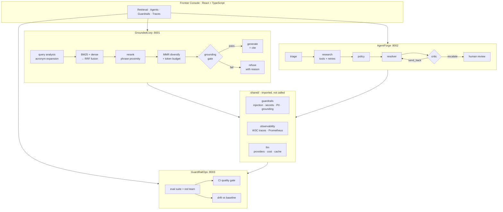
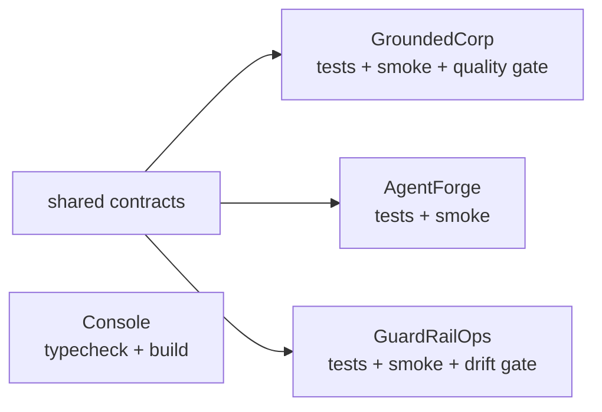

<div align="center">

# Frontier Platform

### Most AI demos answer every question. This one knows when to shut up.

A governed AI platform in three services — grounded retrieval, a multi-agent workflow,
and the guardrail library both of them import — wired to an evaluation suite that
**fails the build when answer quality drops.**

[](https://github.com/JamesKevinJones/frontier-platform/actions/workflows/ai-quality-gate.yml)


**[Live console →](https://frontier-platform-lovat.vercel.app)**  ·  [Quickstart](#quickstart)  ·  [Architecture](#how-it-fits-together)  ·  [What each service proves](#the-three-services)

</div>

---

## The uncomfortable question this answers

Any weekend project can pipe a question into an LLM and render the reply. The
questions that actually come up in a production review are harder:

> *How do you know the answer was right?*
> *What stops it inventing a leave policy?*
> *What happens when your vector store returns garbage?*
> *Who gets paged when quality drops 8% after a model swap?*

This platform is built around those four questions. Three properties fall out of
taking them seriously, and they are what make this different from a RAG tutorial:

**1 · It refuses.** Three independent floors — IDF term coverage, reranker score,
and a composite grounding score — gate every answer. Miss any one and the service
says so, naming the floor it missed. On the committed golden set it refuses exactly
the three unanswerable questions and none of the thirteen answerable ones.

**2 · Governance is a library, not a network call.** `shared/guardrails` is imported
by both applications. A guardrail behind an HTTP hop is a guardrail that fails open
the moment the network does.

**3 · Quality is a build step.** `python -m app.gate` fails CI on a drop in citation
hit rate, faithfulness, MRR, precision@k, guardrail recall, or a rise in false
positives. Ordinary CI proves the code runs. This proves the system still behaves.

---

## How it fits together



Every request carries a **W3C `traceparent`** across service boundaries, so a
question answered by GroundedCorp and validated by GuardRailOps shares one trace id.

---

## The numbers, and where they come from

Not aspirational — this is what `python -m app.gate` prints on the committed corpus,
and what CI enforces on every push.

### Retrieval quality · 12 documents, 16 golden questions

| Metric | Result | Gate | Why it matters |
|---|---:|---:|---|
| Citation hit rate | **1.00** | ≥ 0.85 | The answer cites the document that actually contains the answer |
| Precision@k | **0.885** | ≥ 0.60 | The citation list isn't padded with near-misses |
| Recall@k | **1.00** | ≥ 0.90 | The right document is never missed |
| MRR | **1.00** | ≥ 0.75 | The right document is ranked *first*, every time |
| Faithfulness | **0.580** | ≥ 0.30 | Answer content is supported by retrieved evidence |
| Refusal rate | **0.188** | — | Exactly the 3 of 16 questions the corpus cannot answer |
| p95 latency | **3.8 ms** | ≤ 2500 ms | End to end, per question |

> Precision@k started at **0.51**. Rank-based fusion was discarding score magnitude,
> so a passage outscoring the field 14× on BM25 ranked barely above noise. Re-admitting
> max-normalised BM25 alongside the fused rank took it to **0.885** with no loss of recall.

### Guardrail effectiveness · 23 cases, golden + red team

| Metric | Result | Gate |
|---|---:|---:|
| Pass rate | **1.00** | ≥ 0.90 |
| Recall (attacks caught) | **1.00** | ≥ 0.90 |
| Precision | **1.00** | ≥ 0.80 |
| **False positive rate** | **0.00** | ≤ 0.10 |

|  | Guardrail fired | Guardrail allowed |
|---|---:|---:|
| **Actually unsafe** | 11 caught | 0 missed |
| **Actually safe** | 0 wrongly blocked | 12 passed |

> `max_false_positive_rate` is the threshold nobody adds until a guardrail has
> annoyed a business unit into switching it off. A suite that only tests attacks
> can be passed perfectly by blocking everything — so the suite is balanced and
> scored as a confusion matrix.

---

## Quickstart

**Nothing to install:** the console is live at
**[frontier-platform-lovat.vercel.app](https://frontier-platform-lovat.vercel.app)**.
With no backend reachable it serves recorded fixtures and says so on screen.

To drive the real services:

**Everything runs offline against a deterministic mock provider. No API key, ever.**

```bash
git clone https://github.com/JamesKevinJones/frontier-platform.git
cd frontier-platform/portfolio
docker compose up --build
```

| | |
|---|---|
| Console | http://localhost:5173 |
| GroundedCorp | http://localhost:8001/docs |
| AgentForge | http://localhost:8002/docs |
| GuardRailOps | http://localhost:8003/docs |

<details>
<summary><b>Run a single service without Docker</b></summary>

```bash
cd portfolio/01-groundedcorp
python -m venv .venv && .venv/Scripts/activate      # macOS/Linux: source .venv/bin/activate
pip install -r requirements.txt
python -m app.smoke                                  # ingest → ask → refuse → eval
python -m app.gate                                   # the CI quality gate
python -m uvicorn app.main:app --reload --port 8001
```

</details>

<details>
<summary><b>Point it at a real model</b></summary>

The provider is the only thing that changes — the pipeline, guardrails and evals
are identical.

```bash
export LLM_PROVIDER=ollama
export LLM_BASE_URL=http://127.0.0.1:11434/v1
export LLM_MODEL=llama3.2
```

`mock` · `ollama` · `openai-compatible` are built in. Azure AI Foundry or Vertex AI
is a subclass of `LLMProvider` in `shared/llm/providers.py`.

</details>

---

## The three services

### 🔍 GroundedCorp — retrieval that admits ignorance

Retrieval is where RAG quality is won or lost, so every stage earns its place:

| Stage | What it does | Why not the obvious thing |
|---|---|---|
| **Query analysis** | Expands enterprise acronyms — PTO, MFA, SEV-1, RBAC | A hashing embedder has never seen "PTO" in context. Expansion is far cheaper than a better embedding model |
| **BM25 with real IDF** | Lexical ranking | The naive `tf / √len` scorer rates a term in every document as highly as a rare one. IDF is what makes "accrual" outrank "the" |
| **RRF fusion** | Fuses lexical + dense on **rank** | Vector and lexical scores live on incomparable scales; a weighted sum silently tracks whichever has larger variance |
| **Rerank** | Rewards phrase proximity and coverage | Promotes the passage that *answers* the question over one that merely contains its words |
| **MMR** | Trades relevance for coverage | Top-k by score alone returns four near-duplicate chunks of one paragraph |
| **Relevance floor** | Drops candidates below 65% of the best | Padding citations with near-misses trains users to stop reading citations |
| **Token budget** | Caps the context window | An unbounded window is a cost, latency *and* recall regression |

Then the gate. **Three independent floors, so refusals are explainable:**

```jsonc
{ "refused": true, "refusal_reason": "query_terms_absent_from_corpus" }
{ "refused": true, "refusal_reason": "no_passage_addresses_question" }
{ "refused": true, "refusal_reason": "grounding_below_threshold" }
{ "refused": true, "refusal_reason": "input_guard_blocked" }
```

Also: SSE streaming, structured-output envelopes, a two-tier (exact + semantic)
response cache, per-query USD cost accounting, and drift detection over eval history.

### 🤖 AgentForge — five agents, and a budget that actually stops them

An explicit state graph — the pattern LangGraph implements, written out so the
production-relevant decisions are visible and testable rather than framework-internal.

```
START → triage → research → policy → resolver → critic ─┬→ END
                              ▲                          │
                              └────── send_back ─────────┘
                    budget interrupt ────────────────────→ END (needs_human)
```

- **Bounded.** Cycles capped by `max_loops`, plus a hard step ceiling. Every run terminates.
- **Interruptible.** Budget checked *between* nodes, so a node always completes atomically and state is never half-written. Exceeding it escalates to a human with named decision points — it doesn't silently truncate.
- **Resilient tools.** Timeouts, bounded retries on transient failures only, and a circuit breaker so a dead dependency fails fast instead of burning the budget rediscovering it's dead.
- **Adversarial by construction.** The critic is a separate node from the resolver, because a single-pass agent has no mechanism to catch its own omission. One repair loop, then escalate.
- **Replayable.** Append-only JSONL per ticket. The interesting failures are runs that looped, revised, then looked fine — an overwritten record hides exactly what you need.

### 🛡️ GuardRailOps — the governance plane

Five controls, each with a severity and an action, all policy-driven from `policy.json`:

| Rule | Severity | Action | Direction |
|---|---|---|---|
| `prompt_injection` | high | block | input only |
| `secret` | critical | block + redact | both |
| `pii` | medium | **redact + allow** | both |
| `toxicity` | medium | flag + allow | both |
| `groundedness` | high | block | output |

Three decisions worth defending:

- **Injection rules are input-only.** An answer that *discusses* prompt injection is not an attack. Scoping the rule is what keeps the false positive rate at zero.
- **PII redacts but does not block.** Blocking every email address makes the assistant useless; redacting keeps it usable and safe.
- **Checksums before belief.** Credit-card candidates are Luhn-validated and Aadhaar numbers Verhoeff-validated, so invoice numbers don't get shredded.

Plus drift detection against a frozen baseline, because absolute gates catch a
collapse but not the slow slide.

### 📊 Frontier Console — making the invisible visible

<div align="center">

*Deep slate instrument ground · signal-amber accent · every number on a monospace grid*

</div>

The signature element is the **trace waterfall**: every request leaves a span tree,
and that tree is the clearest answer to *what did the system actually do, and where
did the time go*. Rendered on a shared time axis, so duration and nesting read from
position alone.

The console also shows the query rewrite (watch `PTO` expand to `paid time off ·
leave · vacation · accrual`), the pipeline stage rail, per-citation BM25/rerank/dense
breakdowns, the agent trajectory with tool calls, and the guardrail confusion matrix.

> The hosted demo falls back to recorded fixtures when no backend is reachable, and
> **labels itself as such**. A demo that quietly fakes a live system is a worse
> artifact than one that admits what it is.

---

## Testing and CI

**99 tests.** Not coverage theatre — they encode the behaviours that are expensive
to get wrong:

```
portfolio/tests             32  shared contracts: traceparent round-trip, policy-as-data,
                                bounded span buffers, cache eviction, Luhn/Verhoeff
01-groundedcorp/tests       16  BM25 IDF ordering, rerank proximity, MMR dedup,
                                token budget, precision gate, cache hits, drift
02-agentforge/tests         19  triage precedence, budget-between-nodes, termination,
                                circuit breaker opens, retry succeeds, replay is append-only
03-guardrailops/tests       32  six injection variants, direction scoping, checksum
                                gating, policy override, gate fails on high FPR
```



Shared contracts run first: if the guardrails or tracer break, all three services
break, so failing fast there saves three redundant downstream failures.

---

## Repository map

```
portfolio/
├─ shared/                    imported by every service — the platform's spine
│  ├─ guardrails/             injection · secrets · PII · toxicity · grounding + policy.json
│  ├─ observability/          W3C traces, Prometheus exposition, ASGI middleware
│  └─ llm/                    providers · retries · cost model · two-tier cache
├─ 01-groundedcorp/           RAG: retrieval.py is the context-engineering core
├─ 02-agentforge/             agents: graph.py is the state machine
├─ 03-guardrailops/           governance: eval_runner.py is the gate
├─ console/                   React + TypeScript operator console
├─ tests/                     shared-layer contract tests
└─ docker-compose.yml         the whole platform, one command
```

---

## Built with

`Python 3.12` · `FastAPI` · `Pydantic v2` · `SQLite` · `React 18` · `TypeScript` ·
`Vite` · `Docker` · `GitHub Actions` · `Prometheus exposition` · `W3C Trace Context`

**Zero runtime AI dependencies.** No LangChain, no ChromaDB, no numpy — BM25, RRF,
MMR, hashing embeddings, cosine similarity, Luhn, Verhoeff and the span tracer are
implemented directly. Not to avoid libraries, but because the interesting parts of
an AI framework are the parts you have to reason about in production, and writing
them out makes those decisions explicit, testable, and defensible in a review.

## Elsewhere

Part of [my portfolio](https://portfolio-website-eight-kappa-iwtiz3w2ef.vercel.app),
which introduces each project by the thing it refuses to do. This one refuses to
answer when the evidence is weak.

<div align="center">
<sub>Built by <a href="https://github.com/JamesKevinJones">James Kevin Jones</a></sub>
</div>
